# Spin 事件处理流程图

## 概述

本文档详细描述了 Spin 系统中所有事件类型的处理流程，包括数据存储、索引创建和业务逻辑处理。

## 事件类型总览

系统支持以下7种事件类型：

| 事件类型 | 描述 | 键值前缀 | 主要操作 |
|---------|------|---------|----------|
| TokenCreated | 代币创建事件 | `tc` | 创建代币信息、mint索引 |
| BuySell | 买卖交易事件 | `bs` | 更新价格、交易统计 |
| LongShort | 做多做空事件 | `ls` | 创建订单数据 |
| PartialClose | 部分平仓事件 | `pc` | 更新订单数据 |
| FullClose | 全部平仓事件 | `fc` | 删除订单数据 |
| ForceLiquidate | 强制清算事件 | `fl` | 删除订单数据 |
| MilestoneDiscount | 里程碑折扣事件 | `md` | 更新折扣信息 |

## 整体事件处理流程

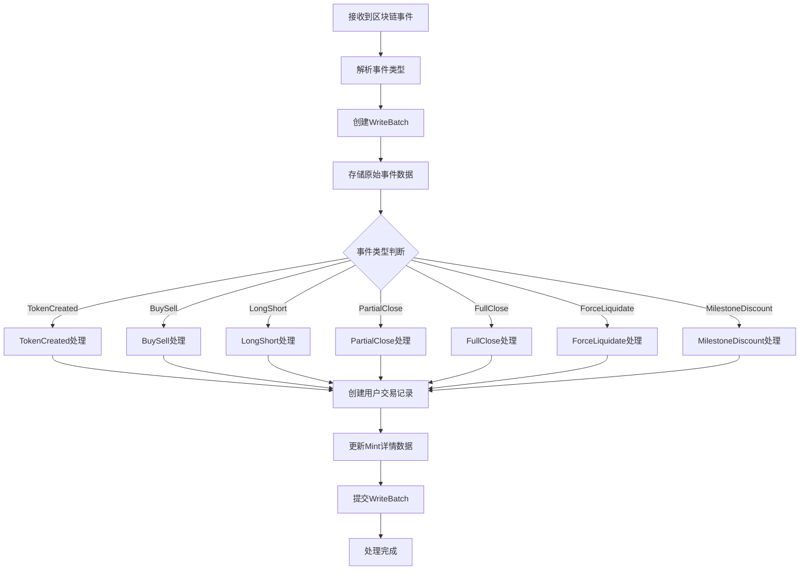

## 详细事件处理流程

### 1. TokenCreated 事件处理

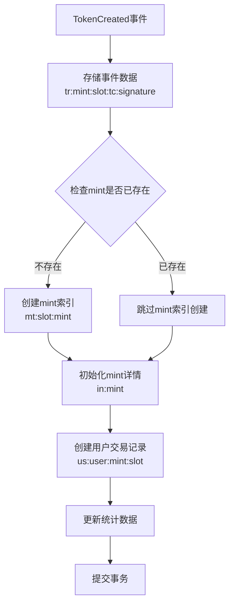

**存储的键值对：**
- `tr:{mint}:{slot}:tc:{signature}` → 完整事件数据
- `mt:{slot:010}:{mint}` → 空值（索引标记）
- `in:{mint}` → mint详情数据
- `us:{user}:{mint}:{slot}` → 用户交易数据

### 2. BuySell 事件处理

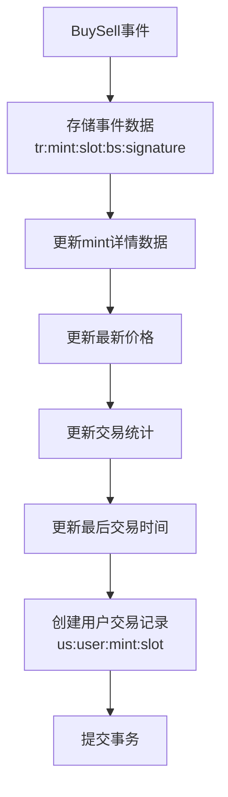

**存储的键值对：**
- `tr:{mint}:{slot}:bs:{signature}` → 完整事件数据
- `in:{mint}` → 更新后的mint详情数据
- `us:{user}:{mint}:{slot}` → 用户交易数据

### 3. LongShort 事件处理

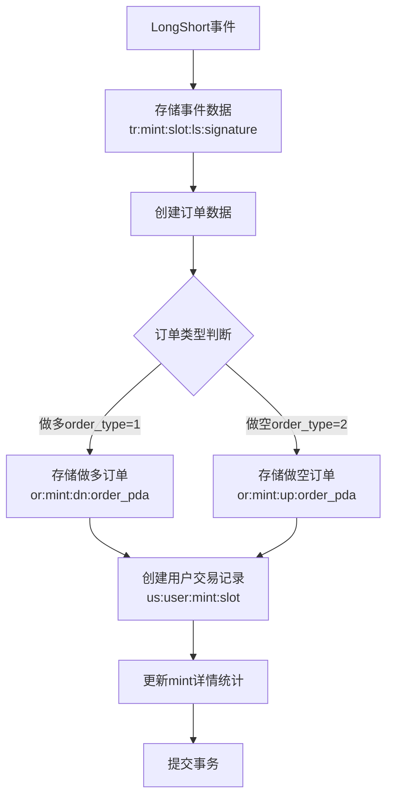

**存储的键值对：**
- `tr:{mint}:{slot}:ls:{signature}` → 完整事件数据
- `or:{mint}:dn:{order_pda}` → 做多订单数据
- `or:{mint}:up:{order_pda}` → 做空订单数据
- `us:{user}:{mint}:{slot}` → 用户交易数据
- `in:{mint}` → 更新后的mint详情数据

### 4. PartialClose 事件处理

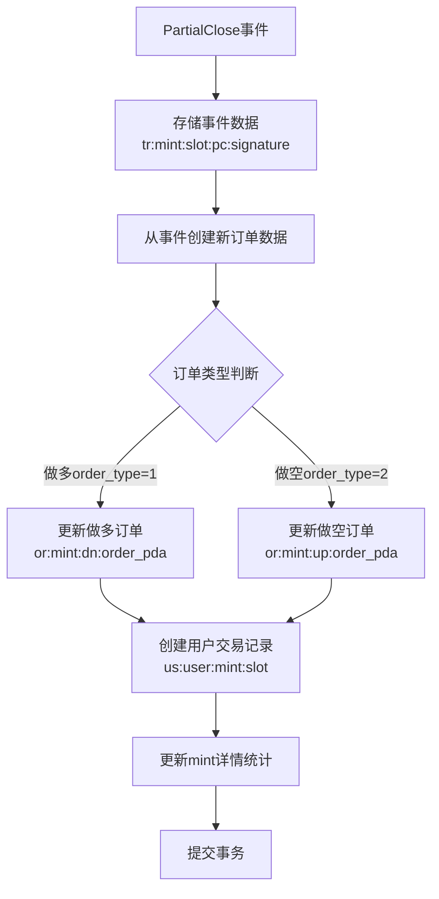

**存储的键值对：**
- `tr:{mint}:{slot}:pc:{signature}` → 完整事件数据
- `or:{mint}:dn/up:{order_pda}` → 更新后的订单数据
- `us:{user}:{mint}:{slot}` → 用户交易数据
- `in:{mint}` → 更新后的mint详情数据

### 5. FullClose 事件处理

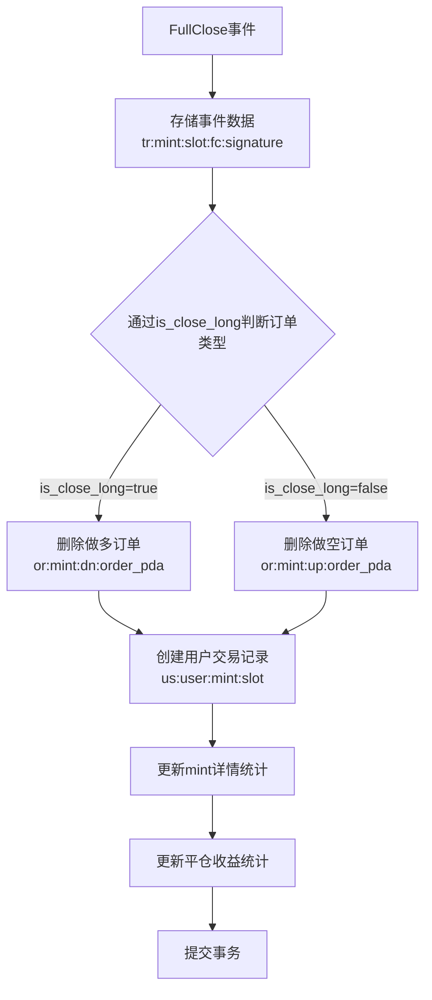

**存储的键值对：**
- `tr:{mint}:{slot}:fc:{signature}` → 完整事件数据
- 删除：`or:{mint}:dn/up:{order_pda}` → 订单数据
- `us:{user}:{mint}:{slot}` → 用户交易数据
- `in:{mint}` → 更新后的mint详情数据

### 6. ForceLiquidate 事件处理

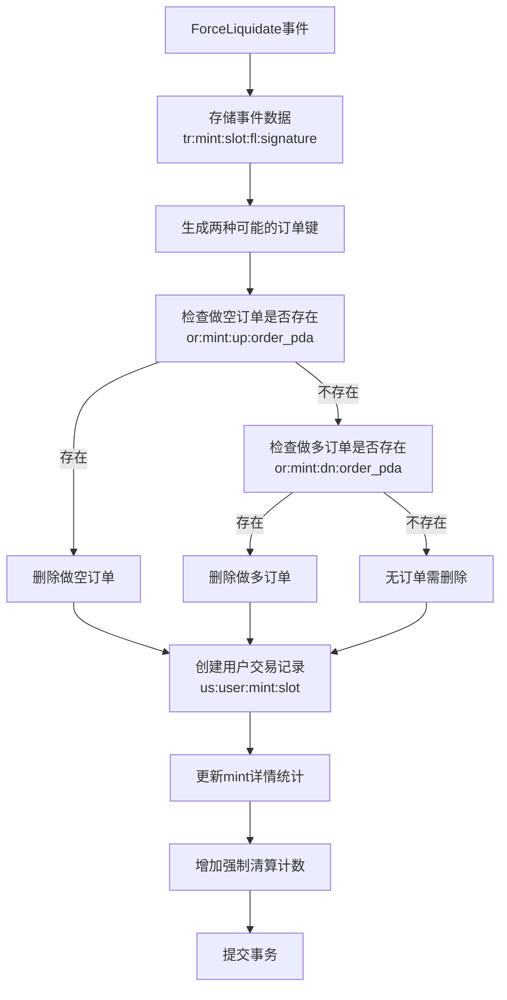

**存储的键值对：**
- `tr:{mint}:{slot}:fl:{signature}` → 完整事件数据
- 删除：`or:{mint}:up/dn:{order_pda}` → 订单数据（根据实际存在情况）
- `us:{user}:{mint}:{slot}` → 用户交易数据
- `in:{mint}` → 更新后的mint详情数据

### 7. MilestoneDiscount 事件处理

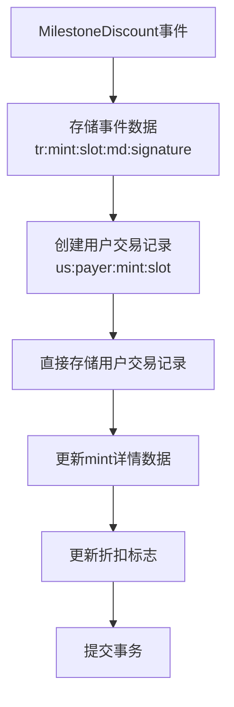

**存储的键值对：**
- `tr:{mint}:{slot}:md:{signature}` → 完整事件数据
- `us:{payer}:{mint}:{slot}` → 用户交易数据（使用payer作为user）
- `in:{mint}` → 更新后的mint详情数据

## 键值存储结构

### 主要键值前缀说明

| 前缀 | 格式 | 用途 | 示例 |
|------|------|------|------|
| `tr:` | `tr:{mint}:{slot}:{type}:{signature}` | 存储所有交易事件 | `tr:ABC123:1000:tc:DEF456` |
| `or:` | `or:{mint}:up/dn:{order_pda}` | 存储订单数据 | `or:ABC123:up:GHI789` |
| `us:` | `us:{user}:{mint}:{slot}` | 存储用户交易记录 | `us:USER123:ABC123:1000` |
| `mt:` | `mt:{slot:010}:{mint}` | 按时间排序的mint索引 | `mt:0000001000:ABC123` |
| `in:` | `in:{mint}` | 存储mint详细信息 | `in:ABC123` |

### 数据流向图

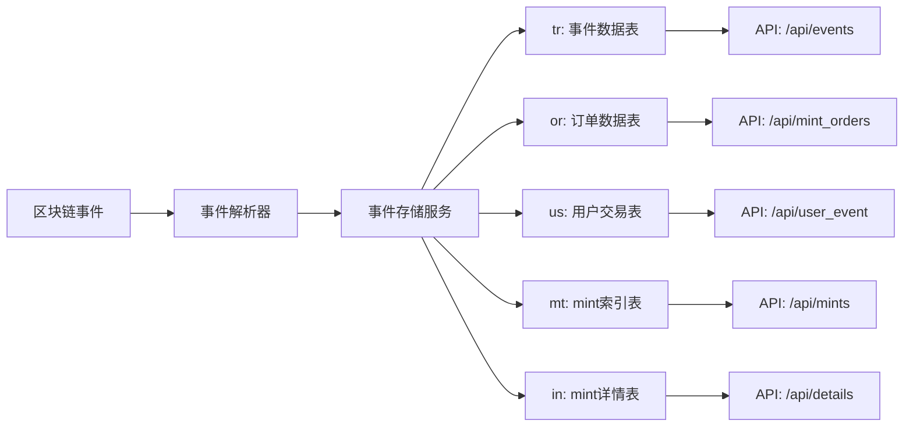

## 事务处理保证

### 原子性保证

所有事件处理都使用 RocksDB 的 WriteBatch 来确保原子性：

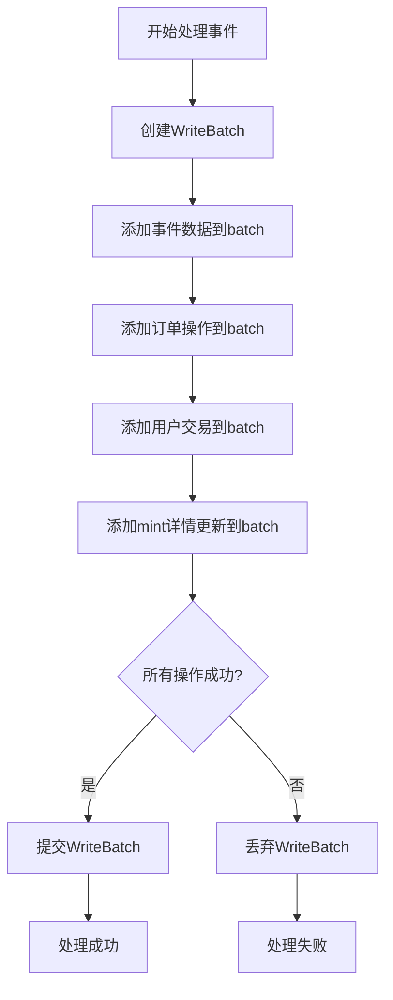

### 错误处理机制

1. **解析错误**：事件解析失败时，记录错误日志但不中断处理
2. **存储错误**：WriteBatch 提交失败时，整个事务回滚
3. **数据一致性**：通过事务确保相关数据的一致性更新

## 性能优化策略

### 批量处理

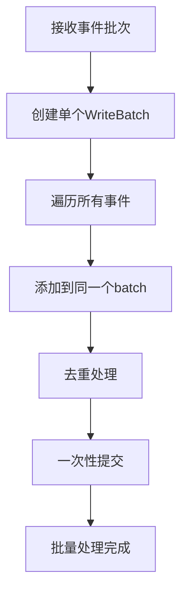

### 索引优化

1. **时间序列索引**：`mt:` 前缀支持高效的时间范围查询
2. **用户索引**：`us:` 前缀支持快速的用户交易查询
3. **订单索引**：`or:` 前缀支持按代币和类型的订单查询

## 监控和日志

### 关键监控指标

- 事件处理延迟
- 存储操作成功率
- 数据库写入性能
- 内存使用情况

### 日志级别

- **DEBUG**：详细的处理步骤
- **INFO**：重要的业务事件
- **WARN**：可恢复的错误
- **ERROR**：严重错误和异常

## 扩展性考虑

### 新增事件类型

添加新事件类型时需要：

1. 在 `SpinPetEvent` 枚举中添加新类型
2. 实现对应的解析逻辑
3. 在 `store_event` 方法中添加处理分支
4. 更新相关的统计和索引逻辑

### 数据迁移

当键值格式发生变化时：

1. 保持向后兼容性
2. 实现数据迁移脚本
3. 逐步淘汰旧格式

---

*本文档描述了当前系统的事件处理流程，随着系统演进可能需要更新。*
