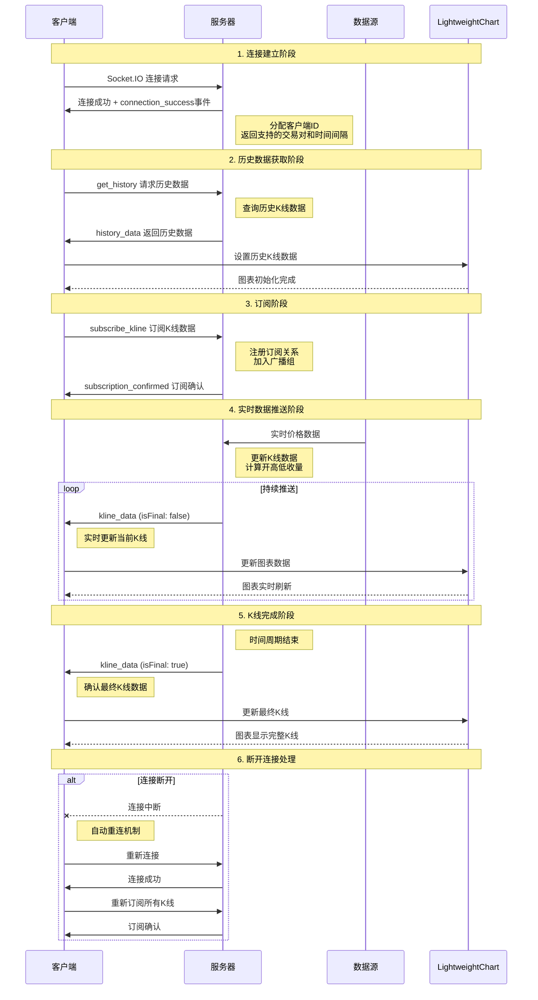
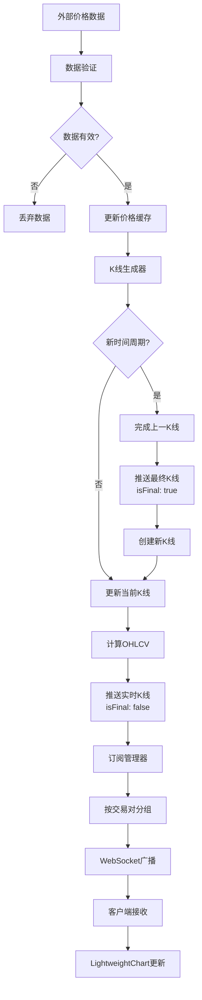
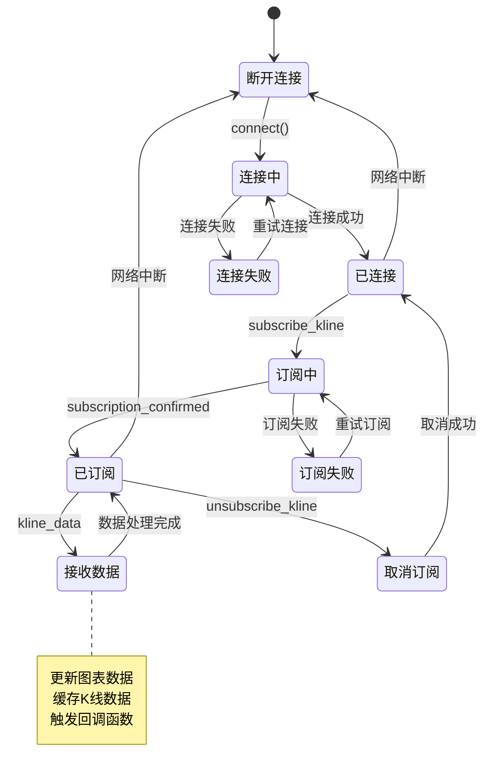
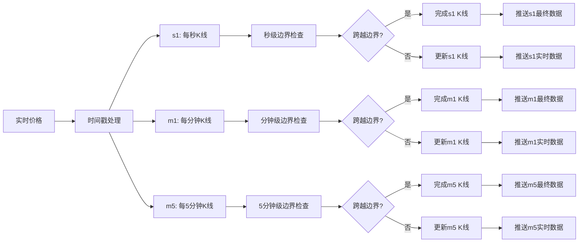
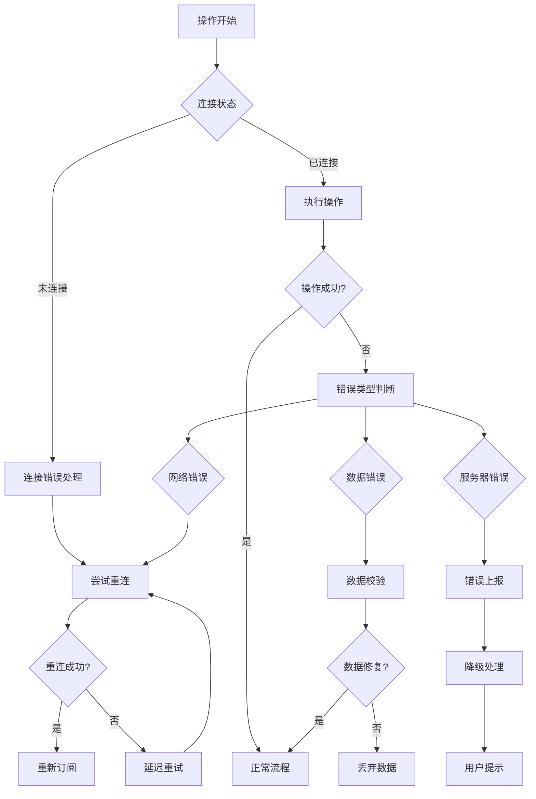

# K线实时推送 WebSocket 协议设计文档

## 概述

本文档定义了一个基于 WebSocket 的 K线数据实时推送服务，服务器端提供 `ws://localhost:8080/ws/kline` 接口，客户端使用 Socket.IO 连接并订阅 K线数据，实现在 LightweightChart 上的实时显示。

## 协议流程图

### 正常情况下的完整流程



### 数据流处理流程



### 客户端状态管理流程



### 时间级别处理逻辑



### 错误处理流程



## 服务器端协议设计

### 1. 连接地址
```
ws://localhost:8080/ws/kline
```

### 2. 连接建立流程

#### 2.1 客户端连接
- 客户端通过 Socket.IO 连接到服务器
- 服务器接受连接并为每个客户端分配唯一的连接ID
- 连接成功后服务器发送欢迎消息

#### 2.2 连接认证（可选）
```javascript
// 连接时可携带参数
{
  auth: {
    token: "optional_auth_token",
    clientId: "unique_client_id"
  }
}
```

### 3. 事件协议定义

#### 3.1 客户端发送事件

##### 订阅K线数据
**事件名**: `subscribe_kline`

**数据格式**:
```javascript
{
  symbol: "BTCUSDT",        // 交易对，必需
  interval: "m1",           // 时间间隔，必需 (s1/m1/m5)
  subscriptionId: "sub_1"   // 订阅ID，可选，用于区分多个订阅
}
```

##### 取消订阅
**事件名**: `unsubscribe_kline`

**数据格式**:
```javascript
{
  symbol: "BTCUSDT",
  interval: "m1",
  subscriptionId: "sub_1"
}
```

##### 获取历史数据
**事件名**: `get_history`

**数据格式**:
```javascript
{
  symbol: "BTCUSDT",
  interval: "m1",
  limit: 100,               // 获取数量，默认100，最大500
  from: 1642680000          // 开始时间戳（秒），可选
}
```

#### 3.2 服务器发送事件

##### 连接成功
**事件名**: `connection_success`

**数据格式**:
```javascript
{
  clientId: "client_12345",
  serverTime: 1642680000,
  supportedSymbols: ["BTCUSDT", "ETHUSDT", "BNBUSDT"],
  supportedIntervals: ["s1", "m1", "m5"]
}
```

##### 订阅确认
**事件名**: `subscription_confirmed`

**数据格式**:
```javascript
{
  symbol: "BTCUSDT",
  interval: "m1",
  subscriptionId: "sub_1",
  success: true,
  message: "订阅成功"
}
```

##### K线数据推送
**事件名**: `kline_data`

**数据格式**:
```javascript
{
  symbol: "BTCUSDT",
  interval: "m1",
  subscriptionId: "sub_1",
  data: {
    time: 1642680000,           // Unix时间戳（秒）
    open: 42000.50,             // 开盘价
    high: 42150.00,             // 最高价
    low: 41980.25,              // 最低价
    close: 42100.75,            // 收盘价（当前价格）
    volume: 123.456,            // 成交量
    isFinal: false,             // 是否为最终K线
    updateType: "realtime"      // 更新类型: realtime/final
  },
  timestamp: 1642680060000      // 推送时间戳（毫秒）
}
```

##### 历史数据响应
**事件名**: `history_data`

**数据格式**:
```javascript
{
  symbol: "BTCUSDT",
  interval: "m1",
  data: [
    {
      time: 1642680000,
      open: 42000.50,
      high: 42150.00,
      low: 41980.25,
      close: 42100.75,
      volume: 123.456,
      isFinal: true
    }
    // ... 更多历史数据
  ],
  hasMore: false                // 是否还有更多数据
}
```

##### 错误消息
**事件名**: `error`

**数据格式**:
```javascript
{
  code: 1001,
  message: "无效的交易对",
  data: {
    symbol: "INVALID_SYMBOL",
    interval: "m1"
  }
}
```

### 4. 服务器端架构设计

#### 4.1 数据流架构
```
外部数据源 → 数据处理器 → K线生成器 → WebSocket广播器 → 客户端
     ↓
   数据缓存 ← K线存储器
```

#### 4.2 核心组件设计

##### 连接管理器 (Connection Manager)
- 管理所有客户端连接
- 维护连接状态和订阅关系
- 处理连接断开和重连

##### 订阅管理器 (Subscription Manager)
- 管理客户端订阅关系
- 支持按交易对和时间间隔分组
- 优化广播性能，避免重复计算

##### K线生成器 (Kline Generator)
- 接收实时价格数据
- 生成不同时间级别的K线
- 处理K线的开始、更新和完成

##### 数据缓存器 (Data Cache)
- 缓存当前活跃的K线数据
- 提供快速的历史数据查询
- 支持数据持久化

#### 4.3 数据处理流程

##### 价格数据接收
1. 从外部数据源接收实时价格
2. 验证数据格式和有效性
3. 更新内部价格缓存

##### K线数据生成
1. 根据价格数据更新对应时间级别的K线
2. 判断K线是否为新周期开始
3. 计算开高低收和成交量

##### 数据推送
1. 识别订阅了该数据的客户端
2. 格式化数据为协议格式
3. 通过WebSocket推送给客户端

#### 4.4 性能优化设计

##### 数据分组推送
- 按交易对和时间间隔对订阅进行分组
- 一次计算，多客户端复用
- 减少重复的数据处理

##### 增量更新机制
- 区分实时更新和最终确认
- 只推送变化的数据字段
- 客户端智能合并数据

##### 连接池管理
- 限制单个客户端的订阅数量
- 监控连接健康状态
- 自动清理无效连接

## 客户端 Socket.IO 实现方案

### 1. 安装依赖
```bash
npm install socket.io-client
```

### 2. 客户端核心类设计

#### 2.1 K线数据管理器
```javascript
class KlineDataManager {
  constructor() {
    this.socket = null
    this.subscriptions = new Map()  // 订阅管理
    this.klineData = new Map()      // K线数据缓存
    this.callbacks = new Map()      // 回调函数管理
    this.reconnectAttempts = 0
    this.maxReconnectAttempts = 5
    this.reconnectDelay = 5000
  }

  // 连接服务器
  connect(url = 'http://localhost:8080/ws/kline', options = {}) {
    this.socket = io(url, {
      transports: ['websocket'],
      forceNew: true,
      reconnection: true,
      reconnectionAttempts: this.maxReconnectAttempts,
      reconnectionDelay: this.reconnectDelay,
      ...options
    })

    this.setupEventHandlers()
  }

  // 设置事件处理器
  setupEventHandlers() {
    // 连接成功
    this.socket.on('connect', () => {
      console.log('连接成功:', this.socket.id)
      this.reconnectAttempts = 0
      this.resubscribeAll()
    })

    // 连接失败
    this.socket.on('connect_error', (error) => {
      console.error('连接失败:', error)
      this.reconnectAttempts++
    })

    // 断开连接
    this.socket.on('disconnect', (reason) => {
      console.log('连接断开:', reason)
    })

    // 服务器确认消息
    this.socket.on('connection_success', (data) => {
      console.log('服务器信息:', data)
    })

    // 订阅确认
    this.socket.on('subscription_confirmed', (data) => {
      console.log('订阅确认:', data)
      if (!data.success) {
        console.error('订阅失败:', data.message)
      }
    })

    // K线数据推送
    this.socket.on('kline_data', (data) => {
      this.handleKlineData(data)
    })

    // 历史数据响应
    this.socket.on('history_data', (data) => {
      this.handleHistoryData(data)
    })

    // 错误处理
    this.socket.on('error', (error) => {
      console.error('服务器错误:', error)
    })
  }

  // 订阅K线数据
  subscribe(symbol, interval, callback, subscriptionId = null) {
    const subId = subscriptionId || `${symbol}_${interval}_${Date.now()}`
    
    const subscription = {
      symbol,
      interval,
      subscriptionId: subId,
      callback
    }

    this.subscriptions.set(subId, subscription)
    this.callbacks.set(subId, callback)

    if (this.socket && this.socket.connected) {
      this.socket.emit('subscribe_kline', {
        symbol,
        interval,
        subscriptionId: subId
      })
    }

    return subId
  }

  // 取消订阅
  unsubscribe(subscriptionId) {
    const subscription = this.subscriptions.get(subscriptionId)
    
    if (subscription && this.socket && this.socket.connected) {
      this.socket.emit('unsubscribe_kline', {
        symbol: subscription.symbol,
        interval: subscription.interval,
        subscriptionId: subscriptionId
      })
    }

    this.subscriptions.delete(subscriptionId)
    this.callbacks.delete(subscriptionId)
  }

  // 获取历史数据
  getHistory(symbol, interval, limit = 100, from = null) {
    if (this.socket && this.socket.connected) {
      this.socket.emit('get_history', {
        symbol,
        interval,
        limit,
        from
      })
    }
  }

  // 处理K线数据
  handleKlineData(data) {
    const { subscriptionId, data: klineData } = data
    const callback = this.callbacks.get(subscriptionId)
    
    if (callback) {
      // 缓存数据
      const key = `${data.symbol}_${data.interval}`
      this.updateKlineCache(key, klineData)
      
      // 触发回调
      callback(klineData, data)
    }
  }

  // 处理历史数据
  handleHistoryData(data) {
    const key = `${data.symbol}_${data.interval}`
    
    // 更新缓存
    if (!this.klineData.has(key)) {
      this.klineData.set(key, [])
    }
    
    const existingData = this.klineData.get(key)
    const mergedData = this.mergeHistoryData(existingData, data.data)
    this.klineData.set(key, mergedData)

    // 通知相关订阅者
    this.notifyHistoryUpdate(data.symbol, data.interval, mergedData)
  }

  // 更新K线缓存
  updateKlineCache(key, newKline) {
    if (!this.klineData.has(key)) {
      this.klineData.set(key, [])
    }

    const klines = this.klineData.get(key)
    const existingIndex = klines.findIndex(k => k.time === newKline.time)

    if (existingIndex >= 0) {
      // 更新现有K线
      klines[existingIndex] = newKline
    } else {
      // 添加新K线
      klines.push(newKline)
      // 保持数据有序
      klines.sort((a, b) => a.time - b.time)
    }
  }

  // 重新订阅所有
  resubscribeAll() {
    this.subscriptions.forEach((subscription) => {
      this.socket.emit('subscribe_kline', {
        symbol: subscription.symbol,
        interval: subscription.interval,
        subscriptionId: subscription.subscriptionId
      })
    })
  }

  // 断开连接
  disconnect() {
    if (this.socket) {
      this.socket.disconnect()
    }
  }
}
```

### 3. 与 LightweightChart 集成

#### 3.1 图表组件封装
```javascript
// RealtimeKlineChart.jsx
import React, { useEffect, useRef, useState } from 'react'
import { createChart } from 'lightweight-charts'
import { KlineDataManager } from './KlineDataManager'

const RealtimeKlineChart = ({ 
  symbol = 'BTCUSDT', 
  interval = 'm1',
  wsUrl = 'http://localhost:8080/ws/kline'
}) => {
  const chartContainerRef = useRef()
  const chartRef = useRef()
  const candlestickSeriesRef = useRef()
  const volumeSeriesRef = useRef()
  const dataManagerRef = useRef()
  const subscriptionIdRef = useRef()
  
  const [connectionStatus, setConnectionStatus] = useState('disconnected')
  const [currentPrice, setCurrentPrice] = useState(null)
  const [priceChange, setPriceChange] = useState(0)

  // 初始化图表
  useEffect(() => {
    if (!chartContainerRef.current) return

    // 创建图表
    const chart = createChart(chartContainerRef.current, {
      width: chartContainerRef.current.clientWidth || 800,
      height: 500,
      layout: {
        background: { type: 'solid', color: '#ffffff' },
        textColor: 'rgba(33, 56, 77, 1)',
      },
      grid: {
        vertLines: { color: 'rgba(197, 203, 206, 0.5)' },
        horzLines: { color: 'rgba(197, 203, 206, 0.5)' },
      },
      crosshair: { mode: 0 },
      rightPriceScale: {
        borderColor: 'rgba(197, 203, 206, 0.8)',
      },
      timeScale: {
        borderColor: 'rgba(197, 203, 206, 0.8)',
        timeVisible: true,
        secondsVisible: false,
      },
    })

    chartRef.current = chart

    // 添加K线系列
    const candlestickSeries = chart.addCandlestickSeries({
      upColor: '#26a69a',
      downColor: '#ef5350',
      borderVisible: false,
      wickUpColor: '#26a69a',
      wickDownColor: '#ef5350',
    })

    candlestickSeriesRef.current = candlestickSeries

    // 添加成交量系列
    const volumeSeries = chart.addHistogramSeries({
      color: '#26a69a',
      priceFormat: {
        type: 'volume',
      },
      priceScaleId: '',
    })

    volumeSeriesRef.current = volumeSeries

    // 配置成交量位置
    volumeSeries.priceScale().applyOptions({
      scaleMargins: {
        top: 0.7,
        bottom: 0,
      },
    })

    // 配置主要系列位置
    candlestickSeries.priceScale().applyOptions({
      scaleMargins: {
        top: 0.1,
        bottom: 0.4,
      },
    })

    // 处理窗口大小调整
    const handleResize = () => {
      chart.applyOptions({ 
        width: chartContainerRef.current.clientWidth || 800 
      })
    }

    window.addEventListener('resize', handleResize)

    return () => {
      window.removeEventListener('resize', handleResize)
      chart.remove()
    }
  }, [])

  // 初始化数据管理器和WebSocket连接
  useEffect(() => {
    const dataManager = new KlineDataManager()
    dataManagerRef.current = dataManager

    // 监听连接状态
    dataManager.socket?.on('connect', () => {
      setConnectionStatus('connected')
    })

    dataManager.socket?.on('disconnect', () => {
      setConnectionStatus('disconnected')
    })

    // 连接服务器
    dataManager.connect(wsUrl)

    // 订阅K线数据
    const subscriptionId = dataManager.subscribe(symbol, interval, (klineData, fullData) => {
      updateChart(klineData)
      updatePriceInfo(klineData)
    })

    subscriptionIdRef.current = subscriptionId

    // 获取历史数据
    setTimeout(() => {
      dataManager.getHistory(symbol, interval, 100)
    }, 1000)

    return () => {
      if (subscriptionIdRef.current) {
        dataManager.unsubscribe(subscriptionIdRef.current)
      }
      dataManager.disconnect()
    }
  }, [symbol, interval, wsUrl])

  // 更新图表
  const updateChart = (klineData) => {
    if (!candlestickSeriesRef.current || !volumeSeriesRef.current) return

    // 更新K线数据
    candlestickSeriesRef.current.update({
      time: klineData.time,
      open: klineData.open,
      high: klineData.high,
      low: klineData.low,
      close: klineData.close
    })

    // 更新成交量数据
    volumeSeriesRef.current.update({
      time: klineData.time,
      value: klineData.volume,
      color: klineData.close >= klineData.open ? '#26a69a' : '#ef5350'
    })
  }

  // 更新价格信息
  const updatePriceInfo = (klineData) => {
    const prevPrice = currentPrice
    setCurrentPrice(klineData.close)
    
    if (prevPrice !== null) {
      setPriceChange(klineData.close - prevPrice)
    }
  }

  // 格式化价格显示
  const formatPrice = (price) => {
    return price ? price.toFixed(2) : '--'
  }

  // 格式化价格变化
  const formatPriceChange = (change) => {
    if (change === 0) return ''
    const sign = change > 0 ? '+' : ''
    return `${sign}${change.toFixed(2)}`
  }

  return (
    <div>
      {/* 头部信息栏 */}
      <div style={{
        display: 'flex',
        justifyContent: 'space-between',
        alignItems: 'center',
        padding: '10px',
        backgroundColor: '#f5f5f5',
        borderRadius: '4px',
        marginBottom: '10px'
      }}>
        <div>
          <h3 style={{ margin: 0 }}>{symbol} - {interval.toUpperCase()}</h3>
        </div>
        
        <div style={{ display: 'flex', gap: '20px', alignItems: 'center' }}>
          {/* 当前价格 */}
          <div>
            <span style={{ fontSize: '14px', color: '#666' }}>当前价格: </span>
            <span style={{
              fontSize: '18px',
              fontWeight: 'bold',
              color: priceChange > 0 ? '#26a69a' : priceChange < 0 ? '#ef5350' : '#333'
            }}>
              ${formatPrice(currentPrice)}
            </span>
            {priceChange !== 0 && (
              <span style={{
                marginLeft: '8px',
                fontSize: '14px',
                color: priceChange > 0 ? '#26a69a' : '#ef5350'
              }}>
                {formatPriceChange(priceChange)}
              </span>
            )}
          </div>
          
          {/* 连接状态 */}
          <div style={{ display: 'flex', alignItems: 'center', gap: '8px' }}>
            <div style={{
              width: '8px',
              height: '8px',
              borderRadius: '50%',
              backgroundColor: connectionStatus === 'connected' ? '#26a69a' : '#ef5350'
            }} />
            <span style={{
              fontSize: '12px',
              color: connectionStatus === 'connected' ? '#26a69a' : '#ef5350'
            }}>
              {connectionStatus === 'connected' ? '已连接' : '未连接'}
            </span>
          </div>
        </div>
      </div>

      {/* 图表容器 */}
      <div 
        ref={chartContainerRef} 
        style={{ 
          width: '100%', 
          height: '500px',
          border: '1px solid #ddd',
          borderRadius: '4px'
        }} 
      />
    </div>
  )
}

export default RealtimeKlineChart
```

### 4. 使用示例

#### 4.1 基础使用
```javascript
// App.jsx
import React from 'react'
import RealtimeKlineChart from './components/RealtimeKlineChart'

function App() {
  return (
    <div className="App">
      <h1>实时K线图表</h1>
      
      {/* BTCUSDT 1分钟K线 */}
      <RealtimeKlineChart 
        symbol="BTCUSDT"
        interval="m1"
        wsUrl="http://localhost:8080/ws/kline"
      />
      
      {/* ETHUSDT 5分钟K线 */}
      <RealtimeKlineChart 
        symbol="ETHUSDT"
        interval="m5"
        wsUrl="http://localhost:8080/ws/kline"
      />
    </div>
  )
}

export default App
```

#### 4.2 多图表页面
```javascript
// MultiChartPage.jsx
import React, { useState } from 'react'
import RealtimeKlineChart from './components/RealtimeKlineChart'

const MultiChartPage = () => {
  const [selectedSymbol, setSelectedSymbol] = useState('BTCUSDT')
  const [selectedInterval, setSelectedInterval] = useState('m1')

  const symbols = ['BTCUSDT', 'ETHUSDT', 'BNBUSDT']
  const intervals = [
    { value: 's1', label: '1秒' },
    { value: 'm1', label: '1分钟' },
    { value: 'm5', label: '5分钟' }
  ]

  return (
    <div>
      {/* 控制面板 */}
      <div style={{ padding: '20px', backgroundColor: '#f0f0f0' }}>
        <div style={{ display: 'flex', gap: '20px', alignItems: 'center' }}>
          <div>
            <label>交易对: </label>
            <select 
              value={selectedSymbol} 
              onChange={(e) => setSelectedSymbol(e.target.value)}
            >
              {symbols.map(symbol => (
                <option key={symbol} value={symbol}>{symbol}</option>
              ))}
            </select>
          </div>
          
          <div>
            <label>时间间隔: </label>
            <select 
              value={selectedInterval} 
              onChange={(e) => setSelectedInterval(e.target.value)}
            >
              {intervals.map(interval => (
                <option key={interval.value} value={interval.value}>
                  {interval.label}
                </option>
              ))}
            </select>
          </div>
        </div>
      </div>

      {/* 图表展示 */}
      <div style={{ padding: '20px' }}>
        <RealtimeKlineChart 
          key={`${selectedSymbol}_${selectedInterval}`}
          symbol={selectedSymbol}
          interval={selectedInterval}
          wsUrl="http://localhost:8080/ws/kline"
        />
      </div>
    </div>
  )
}

export default MultiChartPage
```

## 错误处理和优化

### 1. 错误处理策略
- 连接失败自动重试
- 数据异常时的降级处理
- 用户友好的错误提示

### 2. 性能优化
- 数据去重和防抖处理
- 内存泄漏防护
- 图表渲染优化

### 3. 用户体验
- 实时连接状态显示
- 加载状态提示
- 响应式设计支持

这套方案提供了完整的WebSocket协议设计和Socket.IO客户端实现，可以直接用于生产环境的实时K线图表系统。